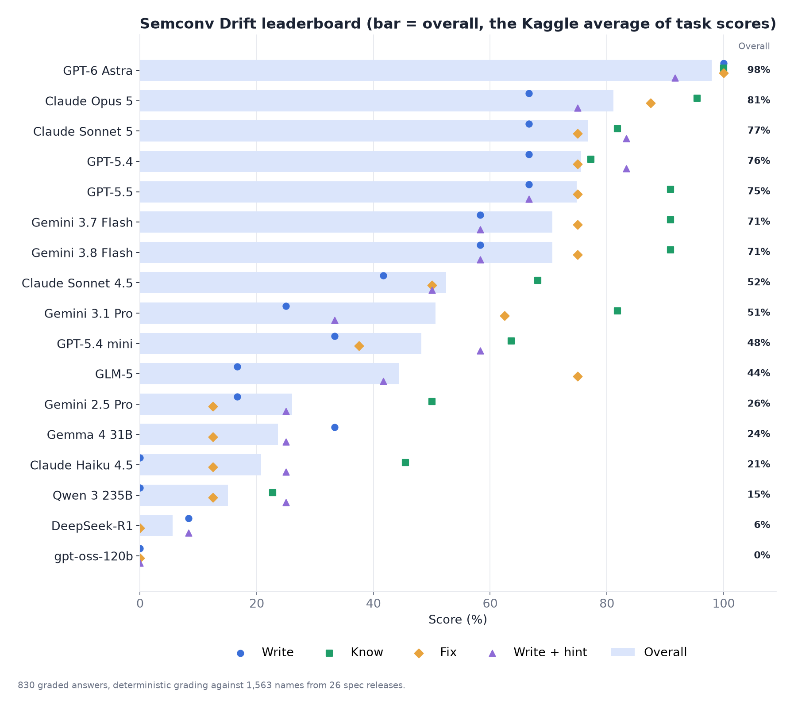
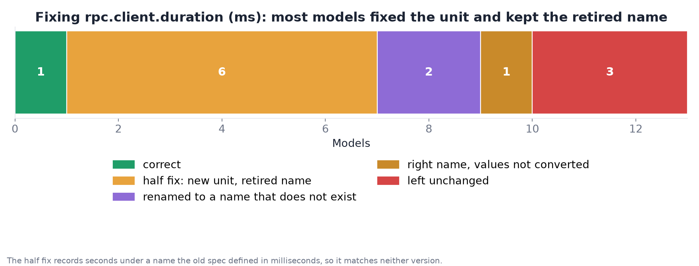

# Semconv Drift

**Do AI models write OpenTelemetry code with names the spec already retired?**

OpenTelemetry's semantic conventions name everything telemetry records: `http.request.method`, `db.system.name`, `http.server.request.duration`. Those names change between releases. A model trained on older tutorials keeps writing the old ones, and nothing fails loudly: the data still flows, while dashboards and alerts quietly stop matching.

**[Website](https://vignesh2027.github.io/semconv-drift/)** · **[Kaggle benchmark](https://www.kaggle.com/benchmarks/applesone/semconv-drift)** · Tasks: [Write](https://www.kaggle.com/benchmarks/tasks/applesone/semconv-drift-write) · [Know](https://www.kaggle.com/benchmarks/tasks/applesone/semconv-drift-know) · [Fix](https://www.kaggle.com/benchmarks/tasks/applesone/semconv-drift-fix) · [Write with version hint](https://www.kaggle.com/benchmarks/tasks/applesone/semconv-drift-write-with-version-hint) · [Results](results/report.md)

Semconv Drift measures that on Kaggle Benchmarks, with four tasks and no AI judge. Every answer is graded in code against 1,563 attribute, metric and event names from 26 releases of the specification (v1.21.0 to v1.44.0).

| Task | Cases | What it asks | What counts as correct |
| --- | ---: | --- | --- |
| **Write** | 12 | Instrument everyday code (HTTP server and client, Postgres, Redis, Kafka, gRPC, metrics, resources) in Python, Go and TypeScript | Only current names, no invented names under a spec namespace, correct time units |
| **Know** | 22 | What replaced a retired name, including span-kind traps, silently dropped metrics and two unchanged controls | The exact current name, and the unit for metrics |
| **Fix** | 8 | Modernize old snippets, including real code from redis/go-redis | No retired name left, required replacements present, units converted, traps avoided |
| **Write with version hint** | 12 | The Write requests plus one sentence naming the current spec version | Same as Write; the difference measures what one line of context buys |

## How grading works

`src/grader.py` extracts every semantic convention name from a model's code: string keys, metric names, event names, SDK constants in Go, TypeScript, Java and Python, and enum values next to their key. It then looks each one up in the ground truth.

- **Retired**: deprecated or dropped by the spec. Names that moved to the separate GenAI repository are not counted as retired.
- **Invented**: a key under a namespace the spec owns (`http.`, `db.`, `messaging.` ...) that no release ever defined. Custom keys outside those namespaces are allowed, as OpenTelemetry allows them. The task grader only knows v1.21.0 onward, so `analyze.py` relabels names that existed in spec releases v1.0.0 to v1.20.0 (`src/pre-v1.21-names.json`) as retired before July 2023. Either way the case fails, so scores do not change.
- **Unit errors**: only time units (`ms` against `s`), where a mistake corrupts data.
- Reasoning models' thinking is removed before grading, so a model is judged on the code it wrote, not on names it considered.

Every retired name carries the release and date that retired it, so the analysis can separate stale training data from changes the model could not have seen.

`build.py` checks every gold answer and required name against the ground truth before writing the task files, so a typo cannot become a wrong answer. `test_grader.py` covers the grader on known inputs.

## Ground truth

`src/semconv.json` is exported from the public [Attrition](https://github.com/vignesh2027/attrition) dataset in Sanity (project `y9raau23`), which imports every tagged release of [open-telemetry/semantic-conventions](https://github.com/open-telemetry/semantic-conventions) and computes a verdict for each retired name from the spec's own `reason`, `renamed_to` and `note` fields.

## Repository layout

| Path | What it is |
| --- | --- |
| `src/` | Grader, the four task sources, ground truth and release dates |
| `build.py` | Builds the self-contained Kaggle task files into `build/` and verifies the gold answers |
| `build/` | The exact files pushed to Kaggle |
| `test_grader.py` | Grader tests |
| `analyze.py` | Downloads every run and writes `results/summary.json` and `results/report.md` |
| `charts.py` | Draws the charts in `results/charts/` |
| `show_answers.py` | Prints what each model answered for one case |
| `sim/` | A small local stand-in for the Kaggle library, used for dry runs before pushing |

## Reproduce

```sh
python3 build.py && python3 test_grader.py
kaggle benchmarks tasks push semconv-drift-write -f build/semconv_drift_write.py
kaggle benchmarks tasks run semconv-drift-write -m gemini-3.8-flash
python3 analyze.py && python charts.py
```

## Results





The full table is in [results/report.md](results/report.md), every chart is in [results/charts](results/charts), and the raw numbers are in [results/summary.json](results/summary.json). The write-up is on DEV.

Data from open-telemetry/semantic-conventions, Apache License 2.0. Built by [vignesh2027](https://github.com/vignesh2027) for the DEV Kaggle Benchmarking Challenge. MIT License.
